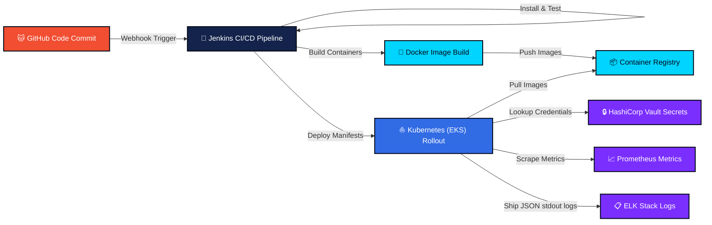

# AstroNet – Operational Data & DevOps Flow

This document outlines the complete lifecycle of a code release and the data flows between application components, users, secrets manager, logs collector, and telemetry monitors.

---

## 🔄 Lifecycle Pipeline Flow

The DevOps pipeline automates the lifecycle from source code changes to deployment and monitoring:



---

## 📊 Operations Data Flow Matrix

Operational data moves through three primary pipelines:

### 1. Secret Management Flow (Vault)
```
[Vault Storage] ──(Decrypt KV)──> [Vault API (8200)] ──(Bearer Token Auth)──> [AstroNet API Pod] ──(In-Memory Config)
```
- **Context**: During node initialization, the backend makes an authenticated HTTP GET request to Vault.
- **Result**: Connection string credentials and JWT keys are loaded directly into application memory. No plain passwords reside in code.

### 2. Metric Telemetry Flow (Prometheus & Grafana)
```
[Frontend/Backend Pods] 
           │
           ▼ (expose /api/devops/status)
[Prometheus Scraper] ──(Pull Scrape every 15s)──> [Prometheus TSDB] <──(Query PromQL)── [Grafana Dashboards]
```
- **Context**: App workloads expose metrics showing CPU usage, connection rate, active missions, and database locks.
- **Result**: Prometheus polls target endpoints, indexes data points, and feeds Grafana to visualize telemetry alerts.

### 3. Log Aggregator Flow (ELK Stack)
```
[Backend Server Logs (stdout)] ──> [Filebeat DaemonSet] ──> [Logstash Pipeline (50000)]
                                                                     │
                                                                 (JSON filter)
                                                                     ▼
[Kibana Dashboards] <──(Discover queries)── [Elasticsearch Database (9200)]
```
- **Context**: Express server logs API routing errors and mission updates.
- **Result**: Logstash structures, indexes, and publishes events to Elasticsearch, rendering searchable event logs in Kibana.
