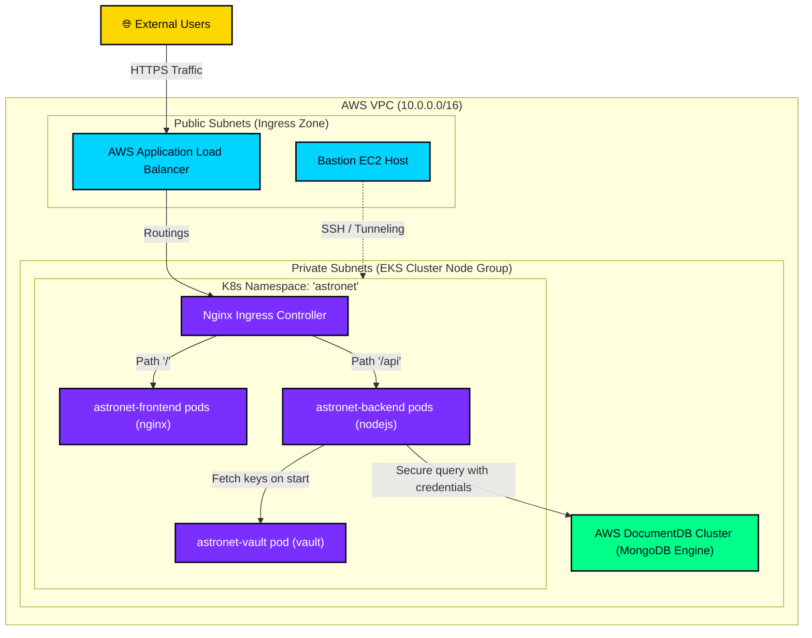

# AstroNet – Deployment Architecture

This document describes the cloud deployment architecture of **AstroNet** on AWS using Kubernetes (EKS).

---

## 🌐 Infrastructure Topology

AstroNet is deployed inside a multi-availability zone VPC. Application pods reside within isolated private subnets, while incoming traffic is routed via public load balancers.

---

## ⛵ Kubernetes Workload Configuration

The application components run as resources inside the target EKS Cluster:

| Resource | Target Deployment | Service Type | Replicas | Autoscaling (HPA) | Port |
|----------|-------------------|--------------|----------|-------------------|------|
| **astronet-frontend** | Web Client UI | NodePort | 2 | Min 2 / Max 5 | 80 |
| **astronet-backend** | Express API Engine | NodePort | 2 | Min 2 / Max 10 | 5000 |
| **astronet-mongodb** | Database State | ClusterIP | 1 | N/A (PVC Backed) | 27017 |
| **astronet-vault** | Secret Management | ClusterIP | 1 | N/A | 8200 |

---

## 🚦 Network Routing & Traffic Ingress
1. **Public Endpoint**: Users access `http://astronet.local` which resolves to the Ingress Controller.
2. **Path Routing**:
   - Matches standard paths `/*` and forwards requests to `astronet-frontend-service` (target port `80`).
   - Matches `/api/*` and rewrites target to pass directly to `astronet-backend-service` (target port `5000`).
3. **Pod Isolation**: NetworkPolicies restrict direct external ingress into database pods (`mongodb`). Only API backend pods are whitelisted to establish connection endpoints on port `27017`.
