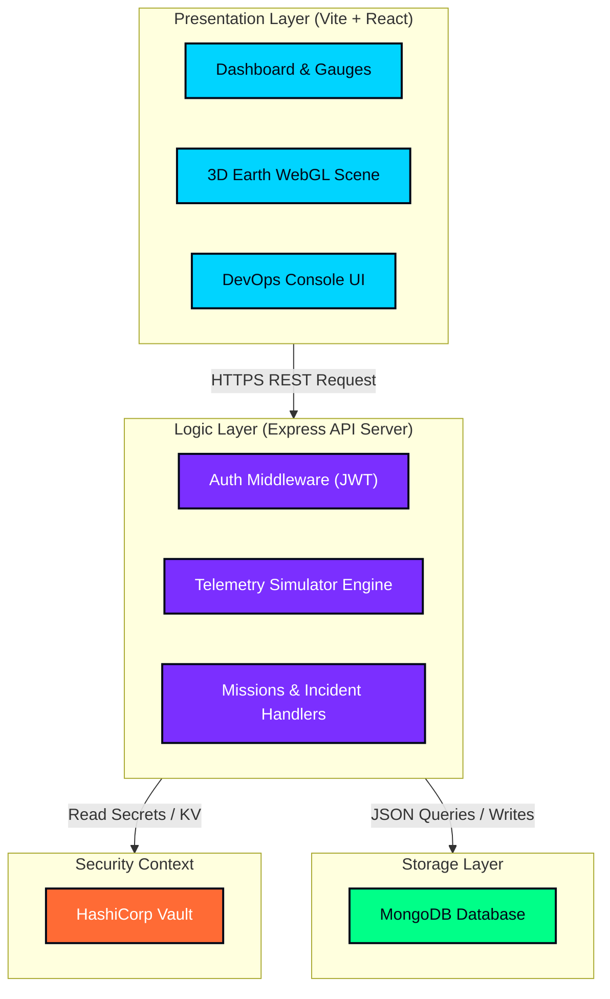
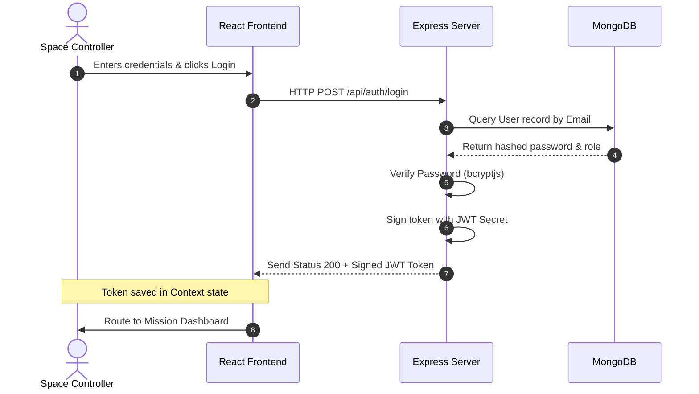

# AstroNet – System Architecture

This document describes the logical software architecture of the **AstroNet Autonomous Space Exploration Operations Platform** and how the system components interact with databases and security elements.

---

## 🏗️ Logical Tier Architecture

AstroNet follows a decoupled, three-tier software model extended with enterprise DevOps services.

---

## 🛠️ Component Breakdown

### 1. Presentation Layer (React SPA)
- **Vite Bundler**: Compiles Javascript/JSX assets. served statically via an Nginx container on port `80`.
- **Three.js / React Three Fiber**: Generates the 3D orbit telemetric simulations (Earth sphere, satellite positioning).
- **Recharts**: Plots telemetry streams (sensor values, power rates, connection bandwidth).

### 2. Logic Layer (Express.js Backend)
- **REST Endpoints**: Routes located in [routes directory](file:///Users/sameerrathod/Desktop/astronet/server/src/routes) managing `/api/auth`, `/api/missions`, `/api/telemetry`, `/api/incidents`, `/api/logs`, `/api/users`, and `/api/devops`.
- **Telemetry Engine**: Emits periodic randomized telemetry data simulating spacecraft orbital changes.
- **Winston / Morgan Logger**: Collects server access outputs and formats them into JSON lines.

### 3. Storage Layer (MongoDB)
- **Mongoose ODM**: Governs schemas for Users, Missions, Telemetry logs, and Incident history tables.
- **Persistent Storage**: Connected via Mongo URI connection string.

### 4. Vault Security Context
- **KV Storage**: Stores database passwords, encryption salts, and JWT secrets.
- **Client Retrieval**: Backend fetches secrets during container startup using the token `VAULT_TOKEN`.

---

## 🔒 Authentication Flow
User authentication utilizes stateless JWT tokens stored in the browser's LocalStorage or Cookies.

